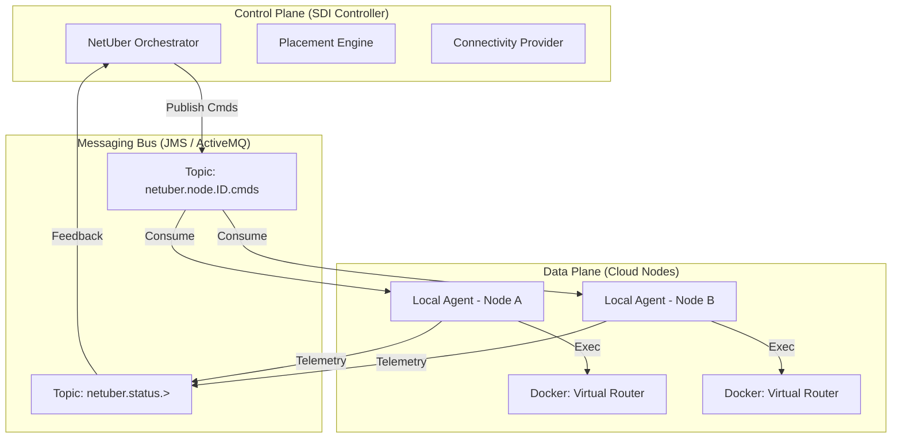

# NetUber
**Software-Defined Internet**

NetUber is a research framework for simulating and orchestrating latency-sensitive web service workflows using a fleet of shared virtual routers (VRs) deployed on cloud spot instances. The framework acts as an evaluation platform for a Software-Defined Internet, enabling dynamic, bandwidth-aware, cost-optimized inter-cloud routing.

## Architecture



### Key Components

* **Core Models**: `Node`, `Link`, `VirtualRouter`, and `Workflow`.
* **LatencyAwarePlacement**: The engine responsible for calculating optimal deployment maps using bandwidth-aware heuristics and critical path latency verification.
* **OverlayManager**: Manages the lifecycle of the shared Virtual Router fleet and simulates regional price fluctuations.
* **ConnectivityProvider**: The Southbound interface using the SDI JSON Protocol over ActiveMQ.
* **LocalAgent**: A distributed agent running on cloud nodes that executes Docker-based VR deployments and generates BGP configurations.

## Features

NetUber provides the following capabilities:

* **DAG-Aware Orchestration**: Workflows are modeled as Directed Acyclic Graphs (DAGs), enabling complex multi-stage pipelines with specific data volume constraints.
* **Dynamic Spot Price Optimization**: The orchestrator dynamically evaluates fluctuating spot prices across regions to minimize deployment costs.
* **Bandwidth-Aware Routing**: Evaluates outbound bandwidth requirements across the service graph to select capable deployment nodes.
* **Resilient Recovery Loop**: Provides automated recovery that re-places services during cloud spot instance preemption (runtime churn).
* **Advanced Latency Verification**: Uses critical path analysis to ensure compliance with service-level objectives (SLOs).
* **Distributed Control Plane**: Uses an event-driven model (ActiveMQ) for real-world orchestration of virtual router fleets.

## Getting Started

### Prerequisites
* **Java 11+**
* **Maven 3.x**
* **ActiveMQ** (Required for the Real SDI implementation. Run locally on `tcp://localhost:61616`)
* **Docker** (Required for actual routing container deployment)

### Running the Real-World SDI Infrastructure

To run the distributed system (Agents + Controller):

```bash
./run_sdi.sh
```

This script compiles the project, launches Local Agents for three simulated regions, and starts the SDI Controller to orchestrate the fleet.

### Running the Simulation Only

For a quick verification without distributed agents:

```bash
./run_simulation.sh
```

## Documentation

For a detailed guide on deploying NetUber in a real cloud environment, see [Tutorial.md](Tutorial.md).

## Citing NetUber

If you use NetUber or the concept of a Software-Defined Internet in your research, please cite the following papers:

* Kathiravelu, P., Chiesa, M., Marcos, P., Canini, M. and Veiga, L., 2018, May. **Moving bits with a fleet of shared virtual routers.** In 2018 IFIP Networking Conference (IFIP Networking) and Workshops (pp. 1-9). IEEE.
  
* Kathiravelu, P., Van Roy, P., Veiga, L. and Benkhelifa, E., 2020, April. **Latency-sensitive web service workflows: A case for a software-defined internet.** In 2020 Seventh International Conference on Software Defined Systems (SDS) (pp. 115-122). IEEE.
